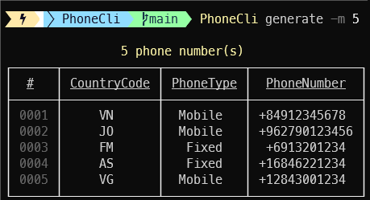

[](https://github.com/aimenux/PhoneCli/actions/workflows/ci.yml)
[](https://www.nuget.org/packages/PhoneCli/)

# PhoneCli
```
A net global tool helping to generate and validate phone numbers
```

> In this repo, i m building a global tool that allows to generate and validate phone numbers.
>
> The tool is based on multiple sub commands :
> - Use sub command `Generate` to generate phone numbers
> - Use sub command `Validate` to validate phone numbers

>
> To run the tool, type commands :
> - `PhoneCli -h` to show help
> - `PhoneCli -s` to show settings
> - `PhoneCli Generate` to generate phone numbers
> - `PhoneCli Validate` to validate phone numbers
>
>
> To install global tool from a local source path, type commands :
> - `dotnet tool install -g --configfile .\nugets\local.config PhoneCli --version "*-*" --ignore-failed-sources`
>
> To install global tool from [nuget source](https://www.nuget.org/packages/PhoneCli), type these command :
> - For stable version : `dotnet tool install -g PhoneCli --ignore-failed-sources`
> - For prerelease version : `dotnet tool install -g PhoneCli --version "*-*" --ignore-failed-sources`
>
> To uninstall global tool, type these command :
> - `dotnet tool uninstall -g PhoneCli`
>
> 
>

**`Tools`** : net 6.0/7.0, command-line, spectre-console, libphonenumber, fluent-validation, fluent-assertions, xunit